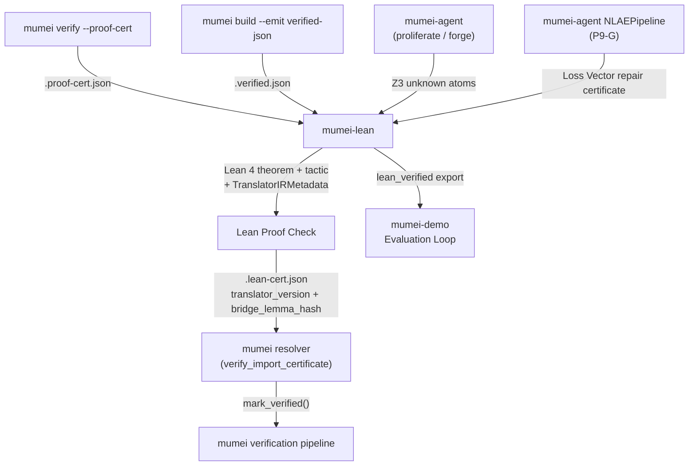

# mumei-lean

External **Lean 4** proof backend for the [mumei](https://github.com/mumei-lang/mumei)
formal verification language.

mumei verifies `requires`/`ensures` contracts automatically with the Z3 SMT
solver. For most atoms this is enough, but Z3 can return `unknown` on
contracts that lie beyond its decidable fragments — quantifier-heavy
properties, deep recursion, or domains like cryptographic primitives where a
hand-written proof is unavoidable.

`mumei-lean` is the *external complement*: it picks up those `unknown` atoms,
re-states them in Lean 4, lets you (or `mathlib4`) discharge the proof
obligation, and emits a mumei-compatible `.lean-cert.json` certificate that
the mumei resolver consumes through its existing
[Proof Certificate Chain (P5-A)](https://github.com/mumei-lang/mumei/blob/main/docs/PROOF_CERTIFICATE.md)
and `MUMEI_PROOF_BUNDLE` machinery (SI-5 Phase 3-C). The bridge now preserves
the typed Lean translator contract: `TranslatorIRMetadata`, binder mappings,
bridge lemma hashes, and manual lemma reasons move through ingestion, Lean
checking, and certificate export as auditable metadata.

For P9-G NLAE integration, `mumei-lean` is the **Fidelity Checker**: it
confirms that the reconstructed `.mm` obligation promoted by mumei-agent and
mumei can be exported as a `lean_verified` certificate, including live generated
theorem paths when they build successfully.

Cross-project vocabulary follows `mumei-lang/mumei/docs/CROSS_PROJECT_ROADMAP.md`: `harness_contract`, `intent_fidelity`, `artifact_paths`, `budget_policy_fingerprint`, and `lean_verified` are the canonical field names. Lean fallback documentation in this repo and `mumei-agent/docs/ROADMAP.md` must describe the same contract. The docs-sync contract is pinned by `tests/test_contract_vocabulary.py` so `lean_verified`, `stale_translator`, `translator_version`, and `bridge_lemma_hash` do not drift.

Translator contract updates are spec-first: every new
`TranslatorIRBinder.mumei_type`, `TranslatorIR.lowering_rules` entry, or bridge
lemma name must be documented in `docs/LEAN_TRANSLATOR_SPEC.md` before the
Python bridge emits it. `lean_verified` means a theorem built cleanly with the
current `translator_version` and `bridge_lemma_hash`; `stale_translator` means
that version/hash no longer matches. Array lowering now records both
`mumei_array_bounds_bridge` and `mumei_array_get_bridge`, while integer
machine-range obligations continue to use `mumei_i64_overflow_bridge`.

> mumei's "fully automatic verification" philosophy is preserved. mumei-lean
> only steps in for the slice of contracts Z3 cannot close on its own, and the
> mumei compiler itself requires **zero changes** to consume the resulting
> certificates: they piggy-back on the existing 3-tier resolver lookup.

## Unknown obligation bridge contract

The only promoted Lean path is:

1. Scan mumei proof certificates for atoms whose `z3_result_class == "unknown"` or `z3_check_result == "unknown"`; `status == "unknown"` or an `escalation_reason` alone is not a Lean candidate.
2. Translate each candidate to generated Lean with `translator_ir` metadata, `logic_fragment_tags`, and any `manual_lemma_reason` preserved.
3. Run `lake build` for the generated target unless the command is explicitly in `--no-build` dry-run mode.
4. Export `.lean-cert.json` with `lean_result_metadata` and the top-level atom fields `translator_version` and `bridge_lemma_hash`.
5. mumei accepts `lean_verified` only when those fields match its current constants; mismatches are `stale_translator` and must not be treated as proven.

There are eight live generated theorem paths, each lowering a Z3 `unknown` (or
spurious-candidate) atom to a generated Lean theorem that builds with
`known_witness_used = false`:
`abs_saturating`, `bounded_mul_with_overflow_check`, `constant_time_eq_flag`,
`ff_zero_eq_zero`, `verified_insertion_sort_ascending`, `poly_bound_monotone`
(single non-conjunction nonlinear arithmetic), `exists_pivot_partition`
(forall/exists quantifier alternation), and `sum_nonneg_inductive`
(natural-number induction).

Per-path descriptions and the certificate field-handling table live in
[`docs/LEAN_HARNESS_CONTRACT.md`](docs/LEAN_HARNESS_CONTRACT.md); the current
`translator_version` / `bridge_lemma_hash` contract constants are pinned in
[`docs/LEAN_TRANSLATOR_SPEC.md`](docs/LEAN_TRANSLATOR_SPEC.md).

## Bridge acceptance invariant

An atom is promoted to `lean_verified` only when it was routed from a Z3 `unknown` result, its generated Lean builds without unresolved manual-lemma placeholders, and both the atom and `lean_result_metadata` carry the current `translator_version` and `bridge_lemma_hash`; any mismatch is `stale_translator`. See [`docs/LEAN_HARNESS_CONTRACT.md`](docs/LEAN_HARNESS_CONTRACT.md) for the full invariant and the excluded cases.

## Architecture in one picture



Full diagram and field-by-field schema in
[`docs/ARCHITECTURE.md`](docs/ARCHITECTURE.md), with the body-semantics
pipeline diagram in [`docs/BRIDGE_PIPELINE.md`](docs/BRIDGE_PIPELINE.md).
End-to-end usage and the mumei-side opt-in story live in
[`docs/INTEGRATION.md`](docs/INTEGRATION.md). The NLAH-style escalation
contract is documented in
[`docs/BRIDGE_HARNESS_SPEC.md`](docs/BRIDGE_HARNESS_SPEC.md), and the
artifact-level Lean verifier contract for `.proof-cert.json`, generated Lean,
`lake build`, `.lean-cert.json`, and summary JSON is documented in
[`docs/LEAN_HARNESS_CONTRACT.md`](docs/LEAN_HARNESS_CONTRACT.md).

## Repository layout

```
mumei-lean/
├── lakefile.lean          # Lean 4 build config (mathlib4 dependency)
├── lean-toolchain         # Pinned Lean toolchain (mathlib4-compatible)
├── MumeiLean.lean         # Public umbrella module
├── MumeiLean/
│   ├── Basic.lean         # Core types: MumeiContract, ProofResult
│   ├── CertParser.lean    # Lean.Json-based .proof-cert.json parser
│   ├── TheoremGen.lean    # Helpers used by generated Lean theorems
│   ├── Verify.lean        # Per-atom proof outcome helpers
│   ├── CertWriter.lean    # Lean.Json-based .lean-cert.json writer
│   ├── Pilot.lean         # Hand-proven pilot theorems (PR 3)
│   ├── Ownership.lean     # Ownership Transfer Protocol state proof
│   ├── Patterns.lean      # Reusable SC proof patterns
│   ├── Algebra.lean       # mathlib-backed finite-field/group helpers
│   ├── Crypto.lean        # Hash, signature, and crypto primitive proof patterns
│   ├── AdvancedPatterns.lean  # Reusable domain proof patterns
│   ├── StdMathAbs.lean    # std/math_abs Lean witness proofs
│   ├── Sort.lean          # Sort ascending-preservation bridge (mathlib List.Sorted)
│   └── Settlement.lean    # RTGS settlement and balance proofs
├── scripts/
│   ├── expr_translator.py # mumei contract expr → Lean Prop translator
│   ├── ingest_cert.py     # .proof-cert.json → generated/*.lean
│   ├── export_cert.py     # lake build log + cert → .lean-cert.json
│   ├── bridge.py          # End-to-end orchestrator (humans run this)
│   ├── build.sh           # Optimized full Lake build
│   └── build-target.sh    # Optimized targeted Lake build
├── tests/                 # pytest suite for the Python bridge
├── docs/
│   ├── ARCHITECTURE.md
│   ├── BRIDGE_PIPELINE.md
│   ├── BRIDGE_HARNESS_SPEC.md
│   ├── LEAN_HARNESS_CONTRACT.md
│   ├── LEAN_TRANSLATOR_SPEC.md
│   ├── MATHLIB4_INTEGRATION.md
│   ├── LEAN_EXECUTABLE.md
│   └── INTEGRATION.md
└── .github/workflows/ci.yml
```

## Quick start

### 1. Install Lean 4

The repo pins its toolchain in
[`lean-toolchain`](./lean-toolchain). The easiest path is `elan`:

```bash
curl https://raw.githubusercontent.com/leanprover/elan/master/elan-init.sh -sSf | sh
elan toolchain install $(cat lean-toolchain)
```

### 2. Run the bridge against a mumei certificate

```bash
# Single per-module certificate
python scripts/bridge.py \
    --cert /path/to/some_module/.proof-cert.json \
    --lean-cert-out out/.lean-cert.json

# Whole std bundle
python scripts/bridge.py \
    --bundle /path/to/std-proof-bundle.json \
    --lean-cert-out out/

# Bulk-scan a mumei checkout for unknown atoms
python scripts/bridge.py \
    --scan-unknown /path/to/mumei-checkout \
    --lean-cert-out out/ \
    --no-build         # quick dry run (skip `lake build`)
```

The orchestrator:

1. Reads the input cert(s) (auto-detects `ProofCertificate` vs
   `ProofBundle`).
2. Emits one Lean theorem per `unknown` atom into `generated/`
   (filenames mirror mumei module paths).
3. Runs `lake build` to discharge those theorems (anything left as
   `sorry` is treated as a failure).
4. Validates the translator contract metadata attached to each atom,
   including `translator_version`, `binder_mapping`, and `bridge_lemma_hash`.
5. Writes a mumei-compatible `.lean-cert.json` whose successful atoms
   carry `z3_check_result = "lean_verified"` and the same typed translator
   metadata required by downstream resolver validation.

Drop the resulting `.lean-cert.json` next to the source module (tier 1
of the mumei resolver), or roll it into a bundle and point
`MUMEI_PROOF_BUNDLE` at it (tier 3) — see
[`docs/INTEGRATION.md`](docs/INTEGRATION.md).

### 3. Run the test suite

```bash
python -m pytest -v                         # Python bridge
MUMEI_LEAN_SKIP_LIVE=1 python -m pytest -q  # Skip live Lake-backed tests
lake build                                  # Lean library
```

Bridge E2E pytest coverage for the body-semantics path requires `lake` on
`PATH` and the pinned Lean toolchain installed:

```bash
python -m pytest \
    tests/test_lean_bridge_e2e.py \
    tests/test_bridge.py \
    -v \
    --run-integration \
    -k "lake_available"
```

`tests/test_lean_bridge_e2e.py` now runs the live generated theorem paths when
Lake is available instead of being globally skipped. The fixtures generate
`generated/Generated/Std/Math/Abs.lean`,
`generated/Generated/Std/Math/Patterns.lean`,
`generated/Generated/Std/Crypto/Primitives.lean`, and
`generated/Generated/Std/Algebra/Finite_field.lean`; all export
`z3_check_result = "lean_verified"` with `known_witness_used = false`.

The narrow smoke command used by CI for the `std_math_abs` fixture is:

```bash
mkdir -p out
python scripts/bridge.py \
    --cert tests/fixtures/std_math_abs.proof-cert.json \
    --out-dir generated \
    --lean-cert-out out/std_math_abs.lean-cert.json
python - <<'PY'
import json
payload = json.load(open("out/std_math_abs.lean-cert.json"))
atom = next(a for a in payload["atoms"] if a["name"] == "abs_saturating")
assert atom["z3_check_result"] == "lean_verified", atom
PY
```

### Lean fallback contract

The live-generated paths share one contract with mumei-agent docs:

1. Live-generated theorem paths: `Generated.Std.Math.Abs.abs_saturating_correct`
   in `generated/Generated/Std/Math/Abs.lean`,
   `Generated.Std.Math.Patterns.bounded_mul_with_overflow_check_correct` in
   `generated/Generated/Std/Math/Patterns.lean`,
   `Generated.Std.Crypto.Primitives.constant_time_eq_flag_correct` in
   `generated/Generated/Std/Crypto/Primitives.lean`,
   `Generated.Std.Algebra.Finite_field.ff_zero_eq_zero_correct` in
   `generated/Generated/Std/Algebra/Finite_field.lean`, and the sort
   ascending-preservation path (`verified_insertion_sort_ascending`) which
   lowers to `MumeiLean.Sort.insertion_sort_ascending_bridge` backed by
   mathlib's `List.Sorted`. When these modules build cleanly, their atoms
   record `known_witness_used = false` and may be promoted to `lean_verified`.
2. Known-witness fallback: if generated theorem attribution cannot be used but
   the committed witness still validates, the bridge records
   `lean_module = "MumeiLean.StdMathAbs"`, `known_witness_used = true`, and
   preserves the fallback as explicit metadata rather than pretending the
   live-generated path passed.
3. Failure classification is stable: `lake_missing` means Lake/toolchain is
   unavailable; `partial_translation` means the translator could not emit a
   complete proof obligation; `stale_translator` means `translator_version` or
   `bridge_lemma_hash` no longer matches the current contract. None of these may
   be exported as `lean_verified`.

For dry-run translation or source inspection, generated files can still be
written anywhere with `--no-build`:

```bash
python scripts/bridge.py \
    --cert tests/fixtures/std_math_abs.proof-cert.json \
    --out-dir /tmp/generated \
    --no-build
```
- If a CI runner lacks Lake or mathlib cache, set `MUMEI_LEAN_SKIP_LIVE=1` for
  non-live pytest, or run the bridge with `--no-build --no-export` to validate
  ingestion/translation shape without claiming `lean_verified`.

## Building

### Quick Build (Recommended)

Use the optimized build script for faster builds:

```bash
./scripts/build.sh
```

This script:

- Uses `LEAN_NUM_THREADS` for parallel compilation with all available CPU cores
- Fetches precompiled mathlib4 cache to avoid recompiling the entire library
- Performs incremental builds when possible

### Manual Build

For manual control:

```bash
# Update dependencies and fetch mathlib4 cache
lake update -R
lake exe cache get

# Build with parallel jobs (adjust number based on your CPU)
LEAN_NUM_THREADS=8 lake build
```

### Building Specific Targets

To build only specific modules (faster for development):

```bash
# Build only MumeiLean library (excludes Generated)
./scripts/build-target.sh MumeiLean

# Build specific module
./scripts/build-target.sh MumeiLean.Basic

# Build only Generated library
./scripts/build-target.sh Generated
```

### Performance Notes

- The first build will take longer as it downloads and compiles dependencies
- Subsequent builds are much faster due to Lake's incremental compilation
- The `.lake` directory contains build cache - do not delete it unless necessary
- mathlib4 is pinned to v4.15.0 for stability

## Design constraints (read me before extending)

1. **Typed translator contract preservation.** The bridge treats
   `TranslatorIRMetadata`, `binder_mapping`, `bridge_lemma_hash`,
   `manual_lemma_reason`, and `translator_version` as part of the proof
   contract, not as display-only fields.
2. **No mumei changes required.** mumei-lean is opt-in and ships
   exclusively over the existing certificate chain. The mumei compiler
   keeps treating any `z3_check_result != "unsat"` as unproven, so the
   new `"lean_verified"` value is forward-compatible.
3. **Python is the production bridge today.** The end-to-end JSON ↔ Lean
   source translation still lives in Python, while `MumeiLean.CertParser`
   and `MumeiLean.CertWriter` are implemented Lean.Json-based native
   parser/writer modules for downstream tooling that wants a pure Lean path.
4. **Scope is intentionally small.** The expression translator covers a fixed
   surface — arithmetic/boolean/comparison operators, literals, conditionals,
   compact `match`, typed quantifiers, array access, and known helper/domain
   calls — and emits body-semantics theorems when a certificate carries a
   supported `body_expr`. Finite-field, group-theory, and crypto helpers route
   through `MumeiLean.Algebra` / `MumeiLean.Crypto`; anything unsupported is
   preserved verbatim and gated for a hand-written witness. The full supported
   surface and current limitations are documented in
   [`docs/ARCHITECTURE.md`](docs/ARCHITECTURE.md).
5. **Targeted at Z3-`unknown`.** `mumei-lean` is *not* a replacement for
   Z3. Use it for the atoms Z3 cannot close (cryptographic correctness,
   abstract-algebraic invariants, etc.).

## License

Apache-2.0; see [`LICENSE`](./LICENSE).
