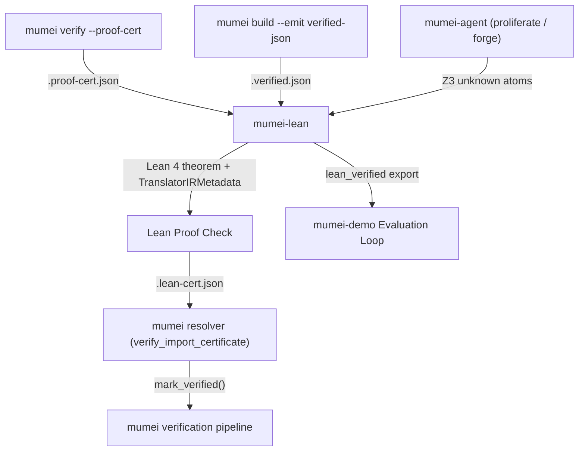

# mumei-lean

External **Lean 4** proof backend for the [mumei](https://github.com/mumei-lang/mumei) formal verification language. It picks up contracts that Z3 classifies as `unknown`, proves them in Lean 4/mathlib4, and emits mumei-compatible `.lean-cert.json` certificates for the existing Proof Certificate Chain.

For P9-G NLAE integration, mumei-lean is the Fidelity Checker: it confirms that reconstructed `.mm` obligations can become `lean_verified` certificates, including live generated theorem paths.

## Distributed proof bundle verification

mumei release bundles expose per-module certificates and a bundle-level
`lean_provenance` index. Consumers use `artifact_paths` to locate each
certificate and source, confirm `z3_check_result: "lean_verified"` together
with the current `translator_version`, `bridge_lemma_hash`, and
`manual_lemma_reason`, and re-run:

```bash
mumei verify-cert <certificate> <source> --strict
```

Use `--allow-lean-verified` explicitly on mumei acceptance paths that permit
Lean results. A translator or bridge-lemma mismatch is `stale_translator`, not
a successful proof.

## Unknown obligation bridge contract

The promoted path is: select Z3 `unknown` atoms, translate them with typed metadata, build generated Lean, export a certificate with `translator_version` and `bridge_lemma_hash`, and let mumei accept only matching `lean_verified` results. Eight live theorem paths are covered: `abs_saturating`, `bounded_mul_with_overflow_check`, `constant_time_eq_flag`, `ff_zero_eq_zero`, `verified_insertion_sort_ascending`, `poly_bound_monotone`, `exists_pivot_partition`, and `sum_nonneg_inductive`. See [`docs/LEAN_HARNESS_CONTRACT.md`](docs/LEAN_HARNESS_CONTRACT.md) for per-path details.

## Bridge acceptance invariant

An atom is `lean_verified` only when it came from Z3 `unknown`, generated Lean builds without unresolved manual lemmas, and current translator metadata matches. Mismatches are `stale_translator`; see [`docs/LEAN_HARNESS_CONTRACT.md`](docs/LEAN_HARNESS_CONTRACT.md).

## Architecture in one picture



See [`docs/ARCHITECTURE.md`](docs/ARCHITECTURE.md), [`docs/BRIDGE_PIPELINE.md`](docs/BRIDGE_PIPELINE.md), and [`docs/INTEGRATION.md`](docs/INTEGRATION.md).

## Quick start

Install the pinned Lean toolchain:

```bash
curl https://raw.githubusercontent.com/leanprover/elan/master/elan-init.sh -sSf | sh
elan toolchain install $(cat lean-toolchain)
```

Run the bridge against a certificate:

```bash
python scripts/bridge.py --cert /path/to/.proof-cert.json --lean-cert-out out/.lean-cert.json
```

Run tests/builds:

```bash
python -m pytest -v
lake build
```

The complete build, test, CI smoke, and fallback guide is [`docs/DEVELOPMENT.md`](docs/DEVELOPMENT.md).

## Repository layout

Top-level modules are `MumeiLean/` (Lean library), `scripts/` (translator and bridge), `tests/` (Python bridge tests), `generated/` (generated theorem sources), and `docs/`. Full layout: [`docs/ARCHITECTURE.md`](docs/ARCHITECTURE.md).

## Design constraints

Preserve the typed translator contract, keep mumei unchanged, use Python as the production bridge, retain the intentionally small supported expression surface, and target Z3-`unknown` rather than replace Z3. Details are in [`docs/ARCHITECTURE.md`](docs/ARCHITECTURE.md).

AI-generated Lean proofs (mumei-agent Task 2-D, `--enable-lean-ai-proof`) already run against this repo: mumei-agent re-runs `scripts/ingest_cert.py` for the trusted theorem statement, lets an LLM write only the tactic script, and promotes to `lean_verified` solely after its own `lake build` in this checkout. The mumei-lean-side acceptance surface for such proofs (B-1 / B-2 / B-3 in [`docs/ROADMAP.md`](docs/ROADMAP.md)) is implemented: `scripts/bridge.py --external-proofs proofs.json` injects a supplied tactic script / witness lemma as the proof body, promotes only through the regular `export_cert.py` gates, writes `ai_proof_used` provenance, and emits per-atom structured `lake build` failures (`lake_build_failures.json`).

## Documentation

| Document | Contents |
|---|---|
| [`docs/ARCHITECTURE.md`](docs/ARCHITECTURE.md) | Architecture, repository layout, supported surface, and design constraints |
| [`docs/DEVELOPMENT.md`](docs/DEVELOPMENT.md) | Build, test, CI smoke, and Lean fallback development guide |
| [`docs/LEAN_HARNESS_CONTRACT.md`](docs/LEAN_HARNESS_CONTRACT.md) | Bridge acceptance invariant and live theorem paths |
| [`docs/LEAN_TRANSLATOR_SPEC.md`](docs/LEAN_TRANSLATOR_SPEC.md) | Translator IR, lowering rules, and contract constants |
| [`docs/BRIDGE_PIPELINE.md`](docs/BRIDGE_PIPELINE.md) | Body-semantics bridge pipeline |
| [`docs/INTEGRATION.md`](docs/INTEGRATION.md) | mumei-side certificate integration |
| [`docs/BRIDGE_HARNESS_SPEC.md`](docs/BRIDGE_HARNESS_SPEC.md) | Escalation and harness contract |
| [`docs/MATHLIB4_INTEGRATION.md`](docs/MATHLIB4_INTEGRATION.md) | Mathlib integration |
| [`docs/LEAN_EXECUTABLE.md`](docs/LEAN_EXECUTABLE.md) | Lean executable usage |

## License

Apache-2.0; see [`LICENSE`](./LICENSE).
