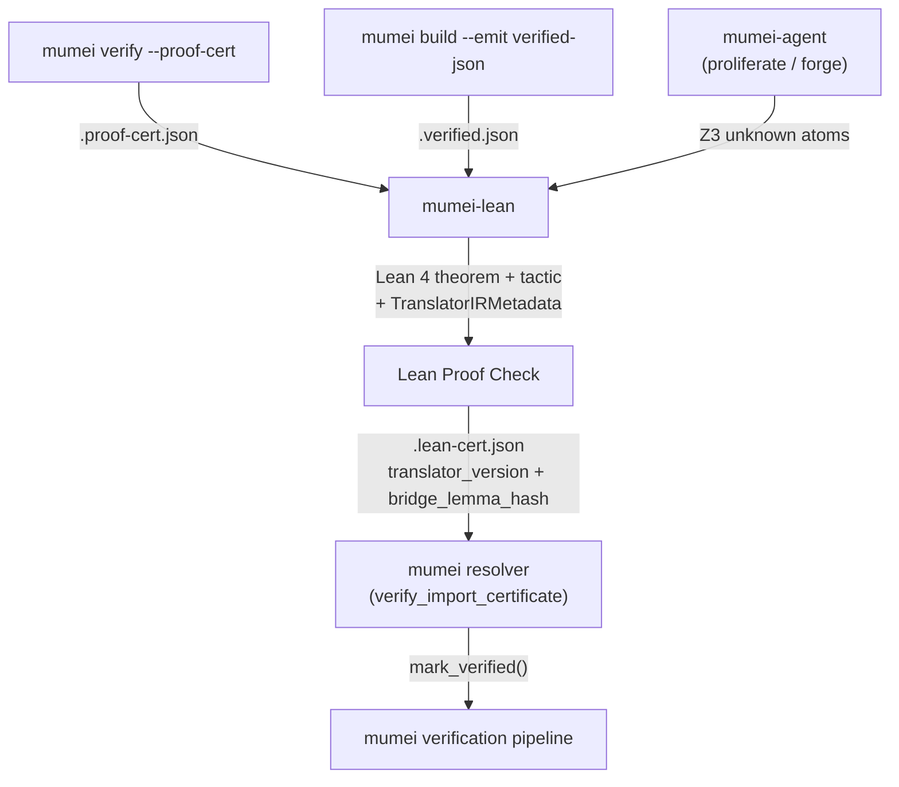

# mumei-lean

External **Lean 4** proof backend for the [mumei](https://github.com/mumei-lang/mumei)
formal verification language.

mumei verifies `requires`/`ensures` contracts automatically with the Z3 SMT
solver. For most atoms this is enough, but Z3 can return `unknown` on
contracts that lie beyond its decidable fragments — quantifier-heavy
properties, deep recursion, or domains like cryptographic primitives where a
hand-written proof is unavoidable.

`mumei-lean` is the *external complement*: it picks up those `unknown` atoms,
re-states them in Lean 4, lets you (or `mathlib4`) discharge the proof
obligation, and emits a mumei-compatible `.lean-cert.json` certificate that
the mumei resolver consumes through its existing
[Proof Certificate Chain (P5-A)](https://github.com/mumei-lang/mumei/blob/main/docs/PROOF_CERTIFICATE.md)
and `MUMEI_PROOF_BUNDLE` machinery (SI-5 Phase 3-C). The bridge now preserves
the typed Lean translator contract: `TranslatorIRMetadata`, binder mappings,
bridge lemma hashes, and manual lemma reasons move through ingestion, Lean
checking, and certificate export as auditable metadata.

> mumei's "fully automatic verification" philosophy is preserved. mumei-lean
> only steps in for the slice of contracts Z3 cannot close on its own, and the
> mumei compiler itself requires **zero changes** to consume the resulting
> certificates: they piggy-back on the existing 3-tier resolver lookup.

## Architecture in one picture



Full diagram and field-by-field schema in
[`docs/ARCHITECTURE.md`](docs/ARCHITECTURE.md), with the body-semantics
pipeline diagram in [`docs/BRIDGE_PIPELINE.md`](docs/BRIDGE_PIPELINE.md).
End-to-end usage and the mumei-side opt-in story live in
[`docs/INTEGRATION.md`](docs/INTEGRATION.md).

## Repository layout

```
mumei-lean/
├── lakefile.lean          # Lean 4 build config (mathlib4 dependency)
├── lean-toolchain         # Pinned Lean toolchain (mathlib4-compatible)
├── MumeiLean.lean         # Public umbrella module
├── MumeiLean/
│   ├── Basic.lean         # Core types: MumeiContract, ProofResult
│   ├── CertParser.lean    # In-Lean .proof-cert.json parser (skeleton)
│   ├── TheoremGen.lean    # Helpers used by generated Lean theorems
│   ├── Verify.lean        # Per-atom proof outcome helpers
│   ├── CertWriter.lean    # In-Lean .lean-cert.json writer (skeleton)
│   ├── Pilot.lean         # Hand-proven pilot theorems (PR 3)
│   ├── Ownership.lean     # Ownership Transfer Protocol state proof
│   ├── Patterns.lean      # Reusable SC proof patterns
│   ├── Algebra.lean       # mathlib-backed finite-field/group helpers
│   └── Settlement.lean    # RTGS settlement and balance proofs
├── scripts/
│   ├── expr_translator.py # mumei contract expr → Lean Prop translator
│   ├── ingest_cert.py     # .proof-cert.json → generated/*.lean
│   ├── export_cert.py     # lake build log + cert → .lean-cert.json
│   └── bridge.py          # End-to-end orchestrator (humans run this)
├── tests/                 # pytest suite for the Python bridge
├── docs/
│   ├── ARCHITECTURE.md
│   └── INTEGRATION.md
└── .github/workflows/ci.yml
```

## Quick start

### 1. Install Lean 4

The repo pins its toolchain in
[`lean-toolchain`](./lean-toolchain). The easiest path is `elan`:

```bash
curl https://raw.githubusercontent.com/leanprover/elan/master/elan-init.sh -sSf | sh
elan toolchain install $(cat lean-toolchain)
```

### 2. Run the bridge against a mumei certificate

```bash
# Single per-module certificate
python scripts/bridge.py \
    --cert /path/to/some_module/.proof-cert.json \
    --lean-cert-out out/.lean-cert.json

# Whole std bundle
python scripts/bridge.py \
    --bundle /path/to/std-proof-bundle.json \
    --lean-cert-out out/

# Bulk-scan a mumei checkout for unknown atoms
python scripts/bridge.py \
    --scan-unknown /path/to/mumei-checkout \
    --lean-cert-out out/ \
    --no-build         # quick dry run (skip `lake build`)
```

The orchestrator:

1. Reads the input cert(s) (auto-detects `ProofCertificate` vs
   `ProofBundle`).
2. Emits one Lean theorem per `unknown` atom into `generated/`
   (filenames mirror mumei module paths).
3. Runs `lake build` to discharge those theorems (anything left as
   `sorry` is treated as a failure).
4. Validates the translator contract metadata attached to each atom,
   including `translator_version`, `binder_mapping`, and `bridge_lemma_hash`.
5. Writes a mumei-compatible `.lean-cert.json` whose successful atoms
   carry `z3_check_result = "lean_verified"` and the same typed translator
   metadata required by downstream resolver validation.

Drop the resulting `.lean-cert.json` next to the source module (tier 1
of the mumei resolver), or roll it into a bundle and point
`MUMEI_PROOF_BUNDLE` at it (tier 3) — see
[`docs/INTEGRATION.md`](docs/INTEGRATION.md).

### 3. Run the test suite

```bash
python -m pytest -v       # Python bridge
lake build                # Lean library
```

## Design constraints (read me before extending)

1. **Typed translator contract preservation.** The bridge treats
   `TranslatorIRMetadata`, `binder_mapping`, `bridge_lemma_hash`,
   `manual_lemma_reason`, and `translator_version` as part of the proof
   contract, not as display-only fields.
2. **No mumei changes required.** mumei-lean is opt-in and ships
   exclusively over the existing certificate chain. The mumei compiler
   keeps treating any `z3_check_result != "unsat"` as unproven, so the
   new `"lean_verified"` value is forward-compatible.
3. **Python is the bridge today.** Doing the JSON ↔ Lean source
   translation in Python is dramatically simpler than reimplementing
   it in `Lean.Json`; the `MumeiLean.CertParser` / `MumeiLean.CertWriter`
   modules are deliberate stubs for the day we want a native path.
4. **Scope is intentionally small.** The expression translator handles
   arithmetic comparisons, boolean connectives, integer literals,
   conditionals, compact `match x { ... }` expressions, typed bounded and
   unbounded quantifiers, `arr[i]`, list/string literals, and known calls
   (`len`, `abs`, `min`, `max`, crypto helpers, finite-field helpers, and
   group helpers). If a certificate carries a supported `body_expr`, the
   bridge emits a Lean `def <atom>Result` plus an `h_body` equality so the
   theorem can prove postconditions from body semantics instead of only
   `requires → ensures`. Anything else is preserved verbatim and tagged
   `-- TODO: unproven` or falls back to the contract-only proof path.
   Current limitations: unknown function calls and domain-specific
   invariants that need bespoke lemmas still require a hand-written
   witness.
5. **Targeted at Z3-`unknown`.** `mumei-lean` is *not* a replacement for
   Z3. Use it for the atoms Z3 cannot close (cryptographic correctness,
   abstract-algebraic invariants, etc.).

## License

Apache-2.0; see [`LICENSE`](./LICENSE).
