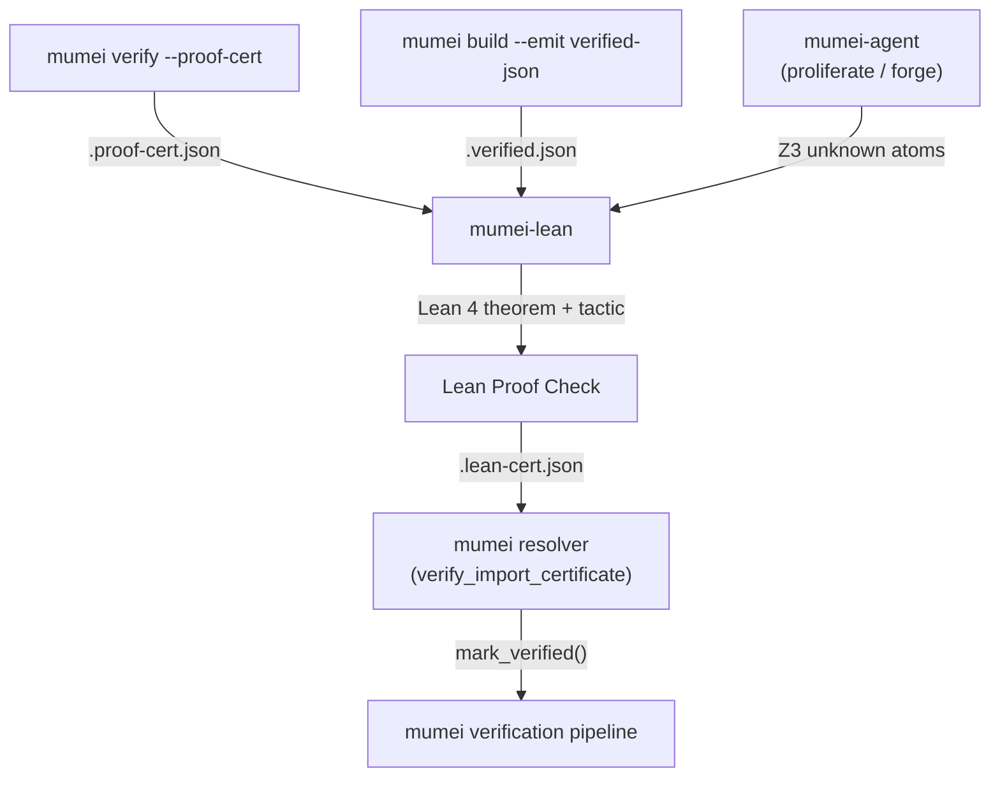
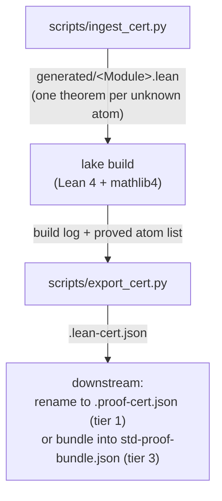

# mumei-lean architecture

> Companion document to [`README.md`](../README.md). Focuses on **how**
> the bridge works end-to-end and which mumei contracts it consumes /
> produces.

## High-level flow



`mumei-lean` is the box in the middle: it consumes per-module
`.proof-cert.json` (or, in future, the richer `--emit verified-json`
output) plus *unknown* atoms surfaced by `mumei-agent`'s proliferate /
forge loops, runs Lean 4 theorems + tactics over them, and emits a
mumei-compatible `.lean-cert.json` that the existing mumei resolver
already understands. The 3-tier search inside
`verify_import_certificate` is unchanged — mumei-lean simply produces
artefacts that fit tier 1 (local `.proof-cert.json`) or tier 3
(`MUMEI_PROOF_BUNDLE`).

### Internal pipeline (mumei-lean side)



## Schema contract with mumei

mumei-lean mirrors the mumei `ProofCertificate` / `AtomCertificate`
structures defined in
[`mumei-core/src/proof_cert.rs`](https://github.com/mumei-lang/mumei/blob/main/mumei-core/src/proof_cert.rs)
and documented in
[`docs/PROOF_CERTIFICATE.md`](https://github.com/mumei-lang/mumei/blob/main/docs/PROOF_CERTIFICATE.md).

### Inputs (consumed)

* **Per-module certificate** (`.proof-cert.json`):
  – atoms with `z3_check_result == "unknown"` are picked up.
  – every other atom is forwarded unchanged when the certificate is
    re-emitted.
* **Bundle** (`std-proof-bundle.json`, SI-5 Phase 3-C):
  – iterated as `modules: { "std/<key>": ProofCertificate, ... }`.
  – the bundle's `bundle_version`, `mumei_version`, and `summary`
    fields are not modified.

### Outputs (produced)

The emitted `.lean-cert.json` keeps the mumei `ProofCertificate`
schema with two additions:

| Field                         | Type     | Meaning                                                                 |
|-------------------------------|----------|-------------------------------------------------------------------------|
| `lean_version`                | `String` | Lean toolchain string used for the build (e.g. `leanprover/lean4:v4.15.0`). |
| `lean_cert_schema_version`    | `String` | Schema version for this Lean-augmented certificate (currently `1.0-lean`). |

Atom-level changes are conservative:

| `AtomCertificate` field | Behaviour                                                                                               |
|-------------------------|---------------------------------------------------------------------------------------------------------|
| `z3_check_result`       | `"unknown"` → `"lean_verified"` if Lean proved the theorem; otherwise unchanged.                        |
| `status`                | `"unknown"` → `"verified"` for proven atoms; otherwise unchanged.                                       |
| `content_hash`, `proof_hash`, `dependencies`, `effects`, `requires`, `ensures` | Forwarded verbatim. |

`certificate_hash` is dropped on emit because the canonical hash
covers the whole serialisation and recomputing it inside mumei-lean
would diverge from upstream's algorithm. The mumei resolver only relies
on per-atom `content_hash` checks, so the dropped field is safe today.
The `all_verified` flag is recomputed: `true` iff every remaining atom
is `unsat` or `lean_verified`.

## What gets generated under `generated/`

`scripts/ingest_cert.py` produces one Lean source file per unique
*module key*. Module keys are derived as follows:

| Source                 | Module key example       | Lean module name           |
|------------------------|--------------------------|----------------------------|
| Per-module certificate | `cert.file = "math.mm"` → `"math"`               | `Generated.Math`           |
| Bundle entry           | `"std/core"`             | `Generated.Std.Core`       |
| Bundle entry           | `"std/container/list"`   | `Generated.Std.Container.List` |

The Lean module prefix is configurable via `--module-prefix`; it
defaults to `Generated`.

Each emitted file has the shape:

```lean
import MumeiLean

namespace Generated.Std.Math

open MumeiLean

/-- Auto-generated from mumei atom `inc` (z3_check_result=unknown). -/
theorem inc_correct (x result : Int) :
    (x > 0) → (result ≥ x) := by
  sorry

end Generated.Std.Math
```

The expression translator (`scripts/expr_translator.py`) handles a
v1 surface:

| Category    | Operators / forms                                              |
|-------------|----------------------------------------------------------------|
| Comparisons | `>`, `>=` (→ `≥`), `<`, `<=` (→ `≤`), `==` (→ `=`), `!=` (→ `≠`) |
| Logical     | `&&` (→ `∧`), `||` (→ `∨`), `!` prefix (→ `¬`)                  |
| Arithmetic  | `+`, `-`, `*`, `/`, `%`                                        |
| Literals    | integer literals, `true`/`false`                               |
| Variables   | identifiers, including `result`                                |

Anything else is forwarded verbatim and the theorem is marked with
`-- TODO: unproven` so it can be triaged via `git grep`.

## Lean-side surface

`MumeiLean` is intentionally tiny:

* `MumeiLean.Basic` — `MumeiContract`, `ProofResult`, helpers to map
  results back to mumei `z3_check_result`/`status` strings.
* `MumeiLean.TheoremGen` — `MumeiBool`, `unproven`, and `MumeiResult`
  used by the generated theorem files.
* `MumeiLean.Verify` — record helpers for assembling the
  `proved/failed` list consumed by `scripts/export_cert.py`.
* `MumeiLean.CertParser` / `MumeiLean.CertWriter` — placeholder
  in-Lean parsers/writers for the future native path.

The Python bridge does not depend on `MumeiLean.CertParser` /
`MumeiLean.CertWriter` at runtime; they only document the eventual
schema contract on the Lean side.

## Failure semantics

| Situation                                                | Outcome                                                                     |
|----------------------------------------------------------|-----------------------------------------------------------------------------|
| Input cert has no unknown atoms                          | `ingest_cert.py` writes nothing; `bridge.py` exits 0 with a friendly message. |
| `lake` is not on PATH                                    | `bridge.py` warns and produces an empty / conservative `.lean-cert.json`.    |
| Generated theorem still uses `sorry` after `lake build`  | `export_cert.py` records the atom as failed (`z3_check_result` unchanged).   |
| Source contract uses constructs outside the v1 surface   | Theorem is emitted verbatim with `-- TODO: unproven` and almost certainly fails to type-check, which `lake build` reports.        |
| Bundle entry whose module key cannot be sanitised        | Falls back to `Generated` (single-segment) so the file is still generated.   |

## Versioning

* `lean-toolchain` pins the Lean version. mathlib4 master is
  fast-moving; CI surfaces drift loudly via `lake build`.
* mumei-side schema changes (e.g. new `AtomCertificate` fields) are
  forward-compatible: `export_cert.py` deep-copies the input and only
  rewrites fields it explicitly understands.
