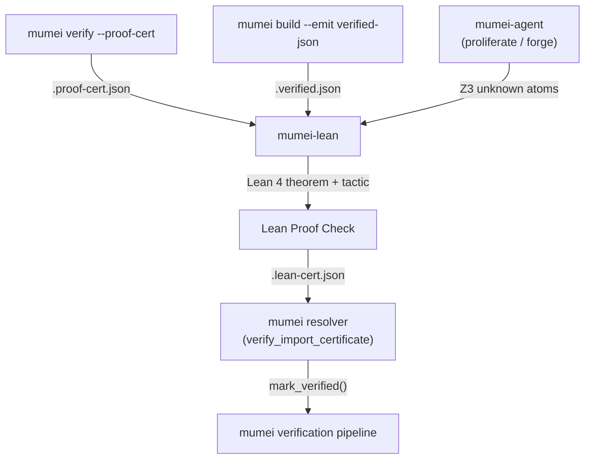
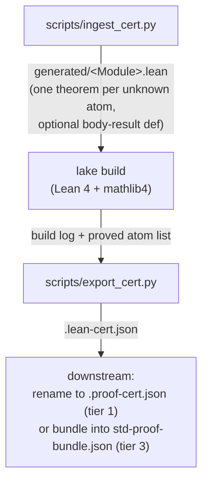

# mumei-lean architecture

> Companion document to [`README.md`](../README.md). Focuses on **how**
> the bridge works end-to-end and which mumei contracts it consumes /
> produces.

## High-level flow



`mumei-lean` is the box in the middle: it consumes per-module
`.proof-cert.json` (or, in future, the richer `--emit verified-json`
output) plus *unknown* atoms surfaced by `mumei-agent`'s proliferate /
forge loops, runs Lean 4 theorems + tactics over them, and emits a
mumei-compatible `.lean-cert.json` that the existing mumei resolver
already understands. The 3-tier search inside
`verify_import_certificate` is unchanged — mumei-lean simply produces
artefacts that fit tier 1 (local `.proof-cert.json`) or tier 3
(`MUMEI_PROOF_BUNDLE`).

The escalation policy is now explicit in
[`BRIDGE_HARNESS_SPEC.md`](BRIDGE_HARNESS_SPEC.md). `scripts/bridge.py`
attaches a `mumei-lean-bridge-harness/v1` contract to summary JSON and exported
certificates so downstream demos and agents can inspect the acceptance path,
artifact obligations, verifier gates, and failure taxonomy without reverse
engineering bridge internals.

### Internal pipeline (mumei-lean side)



## Schema contract with mumei

mumei-lean mirrors the mumei `ProofCertificate` / `AtomCertificate`
structures defined in
[`mumei-core/src/proof_cert.rs`](https://github.com/mumei-lang/mumei/blob/main/mumei-core/src/proof_cert.rs)
and documented in
[`docs/PROOF_CERTIFICATE.md`](https://github.com/mumei-lang/mumei/blob/main/docs/PROOF_CERTIFICATE.md).

### Inputs (consumed)

* **Per-module certificate** (`.proof-cert.json`):
  – atoms with `z3_check_result == "unknown"` are picked up.
  – every other atom is forwarded unchanged when the certificate is
    re-emitted.
* **Bundle** (`std-proof-bundle.json`, SI-5 Phase 3-C):
  – iterated as `modules: { "std/<key>": ProofCertificate, ... }`.
  – the bundle's `bundle_version`, `mumei_version`, and `summary`
    fields are not modified.

### Outputs (produced)

The emitted `.lean-cert.json` keeps the mumei `ProofCertificate`
schema with two additions:

| Field                         | Type     | Meaning                                                                 |
|-------------------------------|----------|-------------------------------------------------------------------------|
| `lean_version`                | `String` | Lean toolchain string used for the build (e.g. `leanprover/lean4:v4.15.0`). |
| `lean_cert_schema_version`    | `String` | Schema version for this Lean-augmented certificate (currently `1.0-lean`). |
| `harness_contract`            | `Object` | Versioned bridge harness metadata describing acceptance path, artifact contracts, and verifier gates. |

Atom-level changes are conservative:

| `AtomCertificate` field | Behaviour                                                                                               |
|-------------------------|---------------------------------------------------------------------------------------------------------|
| `z3_check_result`       | `"unknown"` → `"lean_verified"` if Lean proved the theorem; otherwise unchanged.                        |
| `status`                | `"unknown"` → `"verified"` for proven atoms; otherwise unchanged.                                       |
| `content_hash`, `proof_hash`, `dependencies`, `effects`, `requires`, `ensures` | Forwarded verbatim. |

`certificate_hash` is dropped on emit because the canonical hash
covers the whole serialisation and recomputing it inside mumei-lean
would diverge from upstream's algorithm. The mumei resolver only relies
on per-atom `content_hash` checks, so the dropped field is safe today.
The `all_verified` flag is recomputed: `true` iff every remaining atom
is `unsat` or `lean_verified`.

## What gets generated under `generated/`

`scripts/ingest_cert.py` produces one Lean source file per unique
*module key*. Module keys are derived as follows:

| Source                 | Module key example       | Lean module name           |
|------------------------|--------------------------|----------------------------|
| Per-module certificate | `cert.file = "math.mm"` → `"math"`               | `Generated.Math`           |
| Bundle entry           | `"std/core"`             | `Generated.Std.Core`       |
| Bundle entry           | `"std/container/list"`   | `Generated.Std.Container.List` |

The Lean module prefix is configurable via `--module-prefix`; it
defaults to `Generated`.

Each emitted file has the shape:

```lean
import MumeiLean

namespace Generated.Std.Math

open MumeiLean

/-- Auto-generated from mumei atom `inc` (z3_check_result=unknown). -/
theorem inc_correct (x result : Int) :
    (x > 0) → (result ≥ x) := by
  mumei_arith <;> sorry

end Generated.Std.Math
```

When an input `AtomCertificate` includes a simple `body_expr`, the
renderer also emits body semantics:

```lean
def absSaturatingAutoResult (x : Int) : Int :=
  if x ≥ 0 then x else -x

theorem abs_saturating_auto_correct (x result : Int)
    (h_body : result = absSaturatingAutoResult x) :
    (True) → (result ≥ 0) := by
  rw [h_body]
  unfold absSaturatingAutoResult
  mumei_arith_deep <;> sorry
```

The expression translator (`scripts/expr_translator.py`) handles a
v4 surface:

| Category    | Operators / forms                                              |
|-------------|----------------------------------------------------------------|
| Comparisons | `>`, `>=` (→ `≥`), `<`, `<=` (→ `≤`), `==` (→ `=`), `!=` (→ `≠`) |
| Logical     | `&&` (→ `∧`), `||` (→ `∨`), `!` prefix (→ `¬`)                  |
| Arithmetic  | `+`, `-`, `*`, `/`, `%`                                        |
| Literals    | integer literals, string literals, `true`/`false`               |
| Variables   | identifiers, including `result`                                |
| Conditionals | `if cond then a else b`                                       |
| Match       | `match x { 0 => a, 1 => b, _ => c }` (→ Lean `match x with ...`) |
| Quantifier  | `forall(i, lo, hi, body)`, `exists(i, lo, hi, body)`, `forall x: body`, `exists(x, body)` (→ Lean `∀` / `∃`) |
| Arrays      | `arr[i]` (→ `arr.get! i.toNat`)                                |
| Calls       | `len(x)` (→ `mumei_len x`), `abs(x)` (→ `mumei_abs x`), `min(a, b)`, `max(a, b)`, `old(x)` (→ `old_x`) |
| Strings     | `starts_with(s, prefix)` (→ `mumei_starts_with s prefix`), `ends_with(s, suffix)` (→ `mumei_ends_with s suffix`), `not_contains(s, sub)` (→ `mumei_not_contains s sub`) |
| Finite field | `ff_add(a,b,p)`, `ff_sub`, `ff_mul`, `ff_neg`, `ff_pow`, `ff_inv`, `ff_div`, `ff_in_field(a,p)`, `is_prime(p)`, `mod_eq(a,b,p)` (→ `MumeiLean.Algebra.*`) |
| Group theory | `group_mul(a,b)`, `group_inv(a)`, `group_pow(a,n)`, `group_identity()` (→ `MumeiLean.Algebra.*`) |
| Crypto      | `hash(message,salt)`, `signature_verify(sig,msg,key,n)`, `encrypt(plain,key,nonce)`, `decrypt(cipher,key,nonce)` (→ `MumeiLean.Crypto.*`) |
| Higher-order predicates | `holds(P, x)` (→ `P x`, with `P : Int → Prop`) |

Anything else is forwarded verbatim and the theorem is marked with
`-- TODO: unproven` so it can be triaged via `git grep`. Commas inside
known calls, `forall(..)`, and compact `match { ... }` arms are part of
the supported surface; bare commas elsewhere still mark the expression
partial.

### `len(x)` semantics

`mumei_len` is defined as the identity `Int → Int` (see
[`MumeiLean/Basic.lean`](../MumeiLean/Basic.lean)). The argument `x`
is treated as a **scalar `Int` length parameter**, *not* as a
`List Int` value: contracts are expected to pass the length of an
array as an explicit integer parameter, and `len(n)` simply names
that parameter at the Lean side.

As a consequence, an identifier that appears in **both** `arr[i]`
position (which forces `arr : List Int`) and `len(arr)` position
(which expects `arr : Int`) cannot be typed consistently and is
flagged partial — the generated theorem carries a
`-- TODO: unproven` marker rather than ill-typed Lean. Recommended
contract pattern when both forms are needed:

```text
// Pass the length as a separate Int parameter `n`, not via len(arr):
forall(i, 0, n, arr[i] >= 0)
```

If a future revision needs to extract the actual list length, the
translator can be extended to context-dispatch `len(arr)` to
`arr.length` when `arr` is also used in `arr[i]` position.

## Lean-side surface

`MumeiLean` is intentionally tiny:

* `MumeiLean.Basic` — `MumeiContract`, `ProofResult`, `mumei_len`,
  `mumei_abs`, `mumei_starts_with`, `mumei_ends_with`,
  `mumei_not_contains`, and helpers to map results back to mumei
  `z3_check_result`/`status` strings.
* `MumeiLean.TheoremGen` — `MumeiBool`, `unproven`, and `MumeiResult`
  used by the generated theorem files.
* `MumeiLean.Verify` — record helpers for assembling the
  `proved/failed` list consumed by `scripts/export_cert.py`.
* `MumeiLean.CertParser` — native `.proof-cert.json` parser built on
  `Lean.Json`. Exposes `parseProofCertificate : String → Except String
  ProofCertificateData` and an atom-level `parseAtomCertificate`,
  tolerating optional fields the way `scripts/ingest_cert.py` does.
* `MumeiLean.CertWriter` — native `.lean-cert.json` emitter, also on
  `Lean.Json`. `writeLeanCertificate` re-serialises a parsed
  `ProofCertificateData` after merging a `(name, ProofResult)` list,
  flipping `z3_check_result` to `"lean_verified"` for proved atoms,
  recomputing `all_verified`, and inlining `lean_version`.
* `MumeiLean.Algebra` — mathlib4-backed finite-field (`ZMod` / modular
  arithmetic) and group-theory helpers used by translator calls.
* `MumeiLean.Crypto` — hash determinism/range, signature verification, and
  encryption round-trip proof patterns for cryptographic obligations.
* `MumeiLean.AdvancedPatterns` — reusable quantifier, higher-order predicate,
  induction, finite-field, group, and crypto pattern lemmas for Lean escalation.
* `MumeiLean.StdMathAbs` — hand-written Lean witnesses for real std
  atom contracts from `std/math/abs.mm`, `std/math/fixed_point.mm`,
  and `std/list.mm`.

### Advanced escalation patterns

The v4 translator exposes explicit lowering entry points:

* `translate_quantifier()` routes nested `forall` / `exists` obligations to
  Lean quantifiers instead of leaving them as unsupported Z3 text.
* `translate_finite_field()` maps GF-style helper calls to
  `MumeiLean.Algebra` modular arithmetic / `ZMod` bridge lemmas.
* `translate_group_theory()` maps group helper calls to mathlib4 group laws.

TranslatorIR records `finite_field_lowering`, `group_theory_lowering`,
`crypto_primitive_lowering`, `higher_order_predicate_lowering`, and
`inductive_definition_lowering` metadata. These route Z3 `unknown` obligations
to `MumeiLean.Algebra`, `MumeiLean.Crypto`, and
`MumeiLean.AdvancedPatterns`, which is the intended path for reaching the
≥70% Lean escalation success target on quantified algebraic/crypto contracts.

The Python bridge (`scripts/bridge.py`) is still the production
entry point; the Lean modules above mirror the same logic so
embedded consumers (e.g. `lake env lean --run`) can do a full
parse → mutate → write → reparse cycle without leaving Lean. The
test suite exercises this round trip via
`tests/test_cert_roundtrip.py` (the live `lake env lean --run` arm
is skipped when no toolchain is reachable).

## Failure semantics

| Situation                                                | Outcome                                                                     |
|----------------------------------------------------------|-----------------------------------------------------------------------------|
| Input cert has no unknown atoms                          | `ingest_cert.py` writes nothing; `bridge.py` exits 0 with a friendly message. |
| `lake` is not on PATH                                    | `bridge.py` warns and produces an empty / conservative `.lean-cert.json`.    |
| Generated theorem still uses `sorry` after `lake build`  | `export_cert.py` records the atom as failed (`z3_check_result` unchanged).   |
| Source contract uses constructs outside the v3 surface   | Theorem is emitted verbatim with `-- TODO: unproven` and almost certainly fails to type-check, which `lake build` reports.        |
| Bundle entry whose module key cannot be sanitised        | Falls back to `Generated` (single-segment) so the file is still generated.   |

## Real std proof strategy

The first non-pilot std proof witnesses live in
`MumeiLean/StdMathAbs.lean`.

Verification inputs used while adding them:

```bash
mumei verify std/math/abs.mm --proof-cert --output /tmp/abs.proof-cert.json
mumei verify std/math/fixed_point.mm --proof-cert --output /tmp/fixed_point.proof-cert.json
mumei verify std/list.mm --proof-cert --output /tmp/list.proof-cert.json
```

On current `mumei` `develop`, all three certificates report `unsat`
for every atom (0 `unknown` atoms). To validate the bridge output shape
for the planned unknown-atom path, `abs_saturating` was scratch-marked
as `z3_check_result = "unknown"` and ingested with:

```bash
python scripts/bridge.py \
  --cert /tmp/abs.synthetic-unknown.proof-cert.json \
  --out-dir generated/ \
  --no-build \
  --no-export
```

That emits `generated/Generated/Std/Math/Abs.lean` with an
`abs_saturating_correct` obligation. The checked, committed proof is
kept in `MumeiLean.StdMathAbs` instead of `generated/`, because current
proof certificates carry `requires` / `ensures` but not body semantics.
The module models the relevant body result explicitly and then proves:

* `abs_saturating_correct`: unfolds the saturating abs body and
  discharges the `i64::MIN`, non-negative, and negative branches with
  `norm_num` / `omega`.
* `fixed_point_abs_correct`: unfolds the fixed-point abs body and uses
  `omega` after the sign split.
* `fixed_point_from_int_correct`: the postcondition is exactly the body
  equality, so `exact h_body` closes it.
* `list_length_correct`: unfolds the tag-based list length body and
  closes both branches with `norm_num`.

## Versioning

* `lean-toolchain` pins the Lean version. mathlib4 master is
  fast-moving; CI surfaces drift loudly via `lake build`.
* mumei-side schema changes (e.g. new `AtomCertificate` fields) are
  forward-compatible: `export_cert.py` deep-copies the input and only
  rewrites fields it explicitly understands.

## Roadmap

### Completed

| 項目 | PR | 内容 |
|---|---|---|
| Lean 4 プロジェクト初期構成 | #1 | lakefile.lean, MumeiLean/{Basic,CertParser,TheoremGen,Verify,CertWriter}.lean |
| Python ブリッジ | #1 | scripts/{expr_translator,ingest_cert,export_cert,bridge}.py |
| Pilot 証明 | #3 | pilot_array_identity_correct, pilot_array_offset_correct |
| Ownership 到達不可能性証明 | #5 | MumeiLean/Ownership.lean — no_transfer_without_accept 定理 |
| mumei_arith に decide 追加 | #5 | 有限状態マシンの性質証明用 |
| 実 std/ unknown atom の Lean 証明成功 | this PR | MumeiLean/StdMathAbs.lean — abs_saturating / fp_abs / fp_from_int / list_length |

### Planned

| 項目 | 優先度 | 備考 |
|---|---|---|
| SC 頻出パターン証明ライブラリ | 高 | 加算+上限チェック、保存則（a - x + (b + x) = a + b）、単調性 |
| RTGS 残高保存の帰納的証明 | 高 | Phase 2 Demo。balance_conservation 定理。omega/linarith で自動証明可能 |
| 契約式トランスレータ拡張 | 中 | 量化子・有限体・群論。ブリッジ v1 は算術+論理+整数のみ |
| mumei_arith 拡張 | 中 | ring, field_simp 等の追加。暗号プリミティブ証明用 |
| CertParser.lean / CertWriter.lean ネイティブ実装 | 低 | 現在はスケルトン。Python ブリッジが主要パス |
| ✅ 実 std/ unknown atom の Lean 証明成功 | 完了 | Pilot 以外の実用的な std 証明例を `MumeiLean.StdMathAbs` に追加 |
