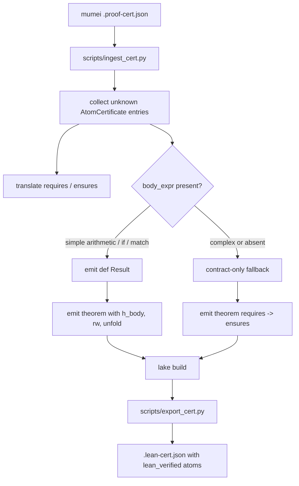

# Bridge pipeline architecture

Simple `body_expr` terms let generated theorems prove postconditions
from body semantics before tactic automation runs. Unsupported body
forms remain safe: the bridge keeps the previous contract-only theorem
shape and any unresolved proof still surfaces as a `sorry` warning.
